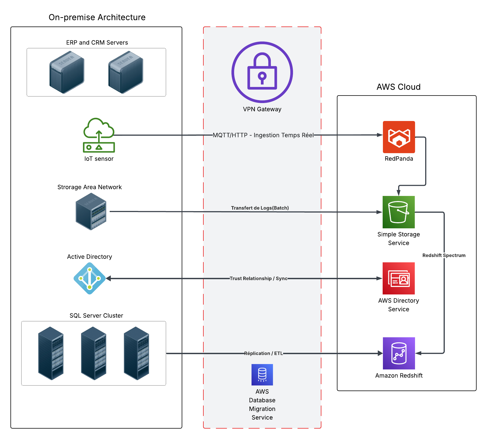
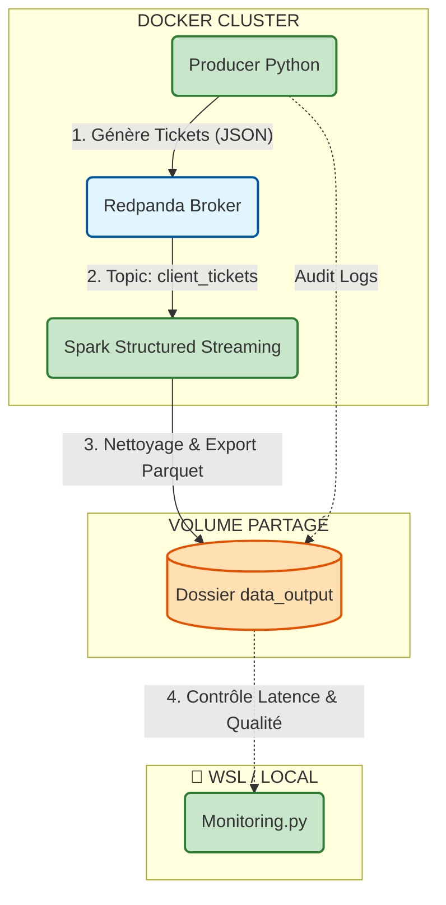

# 🏭 InduTechData - Cloud Architecture & Streaming ETL


Ce projet Data Engineering (Projet 9) se divise en deux volets complémentaires : la **modélisation d'une architecture Cloud Hybride** (AWS) pour une industrie IoT, et le **développement d'un POC technique** (ETL Streaming) pour valider la stack technologique.

---

## 🏗️ PARTIE 1 : Architecture Cloud Hybride (Design)

**Contexte :** Modernisation du SI d'InduTechData pour gérer des flux IoT massifs (50 Go/mois) et 40 To de données historiques.

**Objectif :** Concevoir une infrastructure sécurisée reliant l'usine (On-Premise) au Cloud (AWS).



*   **Ingestion :** Redpanda pour la performance et la compatibilité Kafka.
*   **Stockage :** Data Lake sur **Amazon S3** (Données brutes) et Data Warehouse sur **Amazon Redshift** (Analytique).
*   **Interopérabilité :** Utilisation de **Redshift Spectrum** pour croiser les données chaudes (IoT) et froides (ERP SQL Server).
*   **Sécurité :** VPN Site-to-Site et extension Active Directory (Trust Relationship).

👉 *[Voir le dossier d'architecture complet](docs/01-%20Choix%20des%20services%20AWS%20adaptés.md)*

---

## 💻 PARTIE 2 : Pipeline ETL Streaming (Implémentation POC)

**Contexte :** Pour valider la chaîne de traitement **Redpanda + Spark**, un POC (Proof of Concept) a été développé en local.
**Données :** Simulation d'un flux de **Tickets Support** (JSON) pour tester la transformation et le typage en temps réel.

### Architecture Technique du POC (Docker)



### Fonctionnalités Clés

*   **Ingestion :** Producer Python générant des tickets aléatoires (Faker).
*   **Traitement :** Job Spark Streaming (PySpark 3.5) avec gestion des schémas et enrichissement (catégorisation des demandes).
*   **Stockage :** Écriture au format **Parquet** avec gestion des Checkpoints.
*   **Résilience :** Graceful Shutdown (arrêt propre) sur interception des signaux Docker.
*   **Monitoring :** Dashboard temps réel comparant l'entrée (Producer) et la sortie (Data Lake) pour mesurer le lag.

---

## 🛠️ Installation & Démarrage

### Prérequis

*   **Docker** & **Docker Compose**
*   **Linux** ou **WSL2** recommandé.

### 1. Cloner et Configurer

```bash
git clone https://github.com/votre-user/InduTechData.git
cd InduTechData

# Créer le fichier de configuration (valeurs par défaut optimisées)
cp .env.example .env
```

### 2. Lancer le Pipeline

```bash
docker-compose up --build
```

### 3. Lancer le Monitoring (Optionnel)

Pour visualiser l'avancement depuis votre terminal local :
```bash
# Installation des dépendances légères dev
pip install pandas pyarrow

# Lancement du dashboard
python src/monitoring.py
```

---

## 📂 Structure du Projet

```text
├── src/
│   ├── producer.py       # Générateur de tickets
│   ├── stream_job.py     # ETL Spark Streaming
│   ├── monitoring.py     # Dashboard de contrôle local
│   └── config.py         # Config centralisée
├── docs/                 # Documentation Architecture & FinOps
├── data_output/          # Volume de sortie (Parquet + Checkpoints)
├── Dockerfile            # Image unique optimisée (Python + Java + Spark)
└── docker-compose.yml    # Orchestration
```

## 📚 Documentation Détaillée

*   📄 **[Architecture Hybride & Choix Techniques](docs/01-%20Choix%20des%20services%20AWS%20adaptés.md)**
*   📄 **[Analyse FinOps & Compatibilité SI](docs/02-%20Evaluation%20de%20compatibilité%20SI.md)**
*   🎥 **Démo Vidéo :** *[Lien Youtube à venir]*

---

## 👤 Auteur

**Abdulkadir GUVEN** - Data Engineer Student

[](https://www.linkedin.com/in/abguven/)
